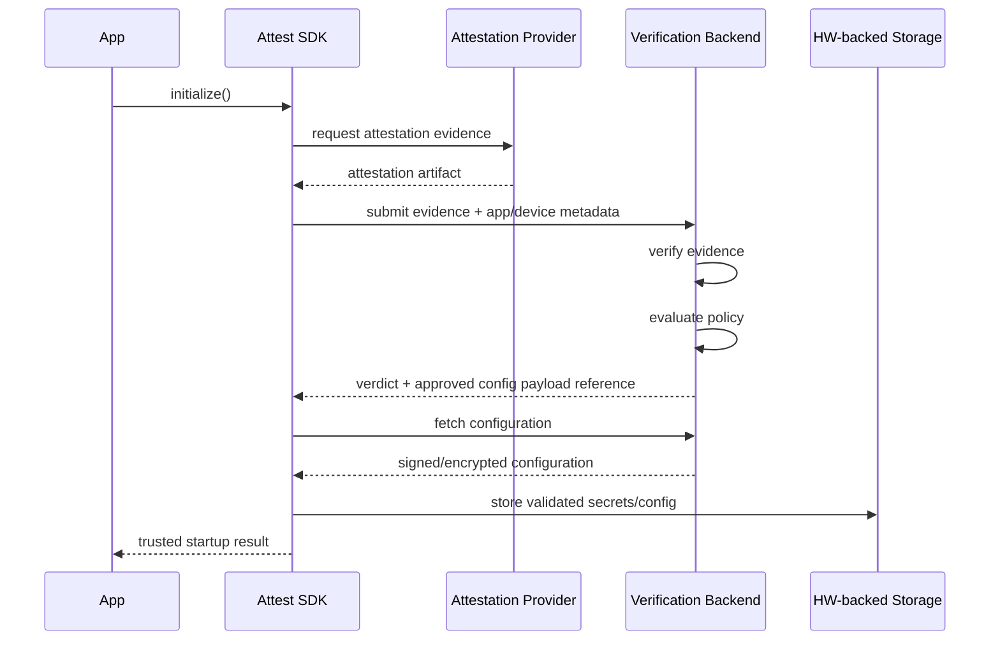
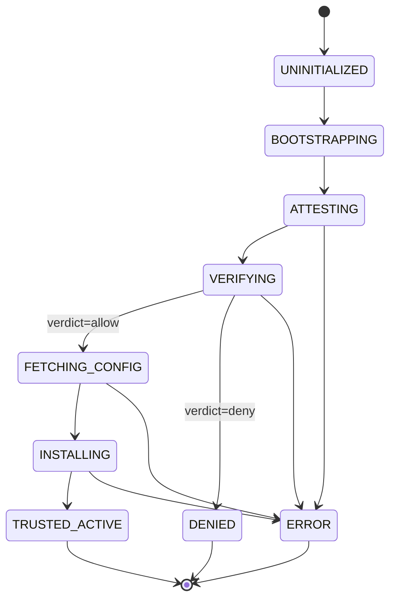

# RFC-0001 — Trust Bootstrap and Device Attestation Architecture

## Status
In Review

## Summary
Define the end-to-end trust bootstrap flow for the Attest mobile SDK, including device/app attestation, backend verification, configuration retrieval, and secure local installation of validated configuration into hardware-backed storage.

## Context
The SDK is part of a broader solution and is responsible for establishing a trusted client execution posture before sensitive configuration is activated. The system must support both a Digitalis-operated backend and customer-managed backends while preserving a consistent security model.

## Problem
The project needs a normative architecture for:
- Attestation on application startup
- Verification and policy evaluation through a backend
- Retrieval of post-attestation configuration
- Secure installation of configuration into hardware-backed storage
- Support for multiple backend deployments without fragmenting the trust model

Without a clear architecture RFC, implementations will drift across platforms, backend variants, and attestation providers.

## Goals
- Establish a single normative startup trust flow
- Define trust boundaries and control points
- Ensure configuration is not activated before attestation and policy evaluation
- Support Android and Apple platforms under a unified conceptual model
- Support Digitalis backend and custom backend deployments
- Minimize platform-specific divergence visible to integrators

## Non-Goals
- Full API schema definitions
- Detailed cryptographic algorithm selection
- Build pipeline and obfuscation implementation details
- Operational runbooks for backend deployment

## Mental Model
The SDK is a trust bootstrap agent.

It should treat the mobile app process as potentially exposed until proven acceptable by attestation and backend policy evaluation. Local secure storage is not the root of trust by itself; it becomes useful only after a validated bootstrap sequence provisions approved material into hardware-backed storage.

## Architecture

## Normative Requirements
1. The SDK MUST execute attestation before activating protected configuration.
2. The SDK MUST treat backend verification as authoritative for attestation verdicts.
3. The SDK MUST NOT rely solely on client-side attestation validation for security decisions.
4. The SDK MUST retrieve configuration only after a successful backend attestation verdict.
5. The SDK MUST store protected configuration material in hardware-backed storage where supported.
6. The SDK MUST fail closed for protected features when attestation, backend verification, or secure installation fails.
7. The SDK SHOULD support degraded operation only for explicitly non-sensitive features and only when policy allows.
8. The architecture MUST support both Digitalis-managed and customer-managed backend implementations through a common contract.

## Trust Boundaries
- **Untrusted/less trusted:** mobile application process, device state, local memory, network path
- **Conditionally trusted:** attestation token/evidence before backend verification
- **More trusted:** backend verification and policy engine
- **Protected local boundary:** hardware-backed keystore / secure enclave / keychain-backed secure material

## Flow
### 1. SDK Initialization
- SDK startup occurs early in application lifecycle
- SDK collects runtime metadata required for attestation and policy decisions
- SDK enters `BOOTSTRAPPING` state

### 2. Attestation
- SDK obtains attestation evidence from the platform-specific provider abstraction
- Evidence may include app integrity, signing identity, device verdicts, nonce binding, and environment indicators

### 3. Backend Verification
- SDK submits evidence to backend
- Backend validates evidence freshness, issuer, audience, nonce binding, and policy compatibility
- Backend returns verdict and configuration authorization decision

### 4. Configuration Retrieval
- SDK fetches configuration only after authorization
- Configuration is integrity-protected and versioned
- Backend may return an inline payload or a reference to fetch the payload

### 5. Secure Installation
- SDK validates configuration metadata
- SDK installs configuration and secret material into hardware-backed storage when available
- SDK records active config version and installation status

### 6. Activation
- SDK transitions to `TRUSTED_ACTIVE` only after successful secure installation
- Protected capabilities become available to the host application

## State Model

### State-Outcome Alignment Note
`TRUSTED_ACTIVE` is the only state in which protected features are enabled. All startup results MUST map to canonical outcomes defined in RFC-0006. The outcome `ALLOW_DEGRADED` is currently an outcome model owned by RFC-0006; it is **not** yet a formal distinct state in this state machine unless promoted later. References to startup results throughout this RFC point to RFC-0006 canonical outcomes (`ALLOW`, `ALLOW_DEGRADED`, `RETRYABLE_FAILURE`, `DENY_POLICY`, `DENY_INTEGRITY`, `UNSUPPORTED_ENVIRONMENT`).

## Backend Contract
The backend contract MUST distinguish:
- evidence submission and verification
- policy decisioning
- configuration retrieval
- key / secret / config version lifecycle

The contract SHOULD permit backend-side feature gating and risk-tiered configuration responses.

## Security Considerations
- Client attestation signals are useful only after server verification
- Replay resistance requires nonce, freshness, and audience binding
- Configuration delivery must be integrity-protected and bound to policy/verdict context
- Sensitive configuration should avoid long-lived plaintext presence in process memory
- Rooted/jailbroken or tampered environments should not automatically imply total failure unless policy says so, but sensitive features must remain gated
- Custom backends increase integration flexibility and also expand the trust surface; conformance validation is required

## Failure Modes
- Attestation provider unavailable
- Backend unreachable
- Evidence invalid or expired
- Policy denied
- Secure hardware unavailable or misconfigured
- Config installation partially succeeds
- Config version rollback attempt

## Open Questions
- Which features, if any, can run in degraded mode?
- Is offline operation supported at all?
- What is the exact config signing/encryption model?
- How are config rollbacks prevented or controlled?

## Consequences
This architecture creates a consistent, backend-authoritative trust bootstrap across platforms. It also constrains startup sequencing, which may introduce latency and operational dependency on backend availability.

