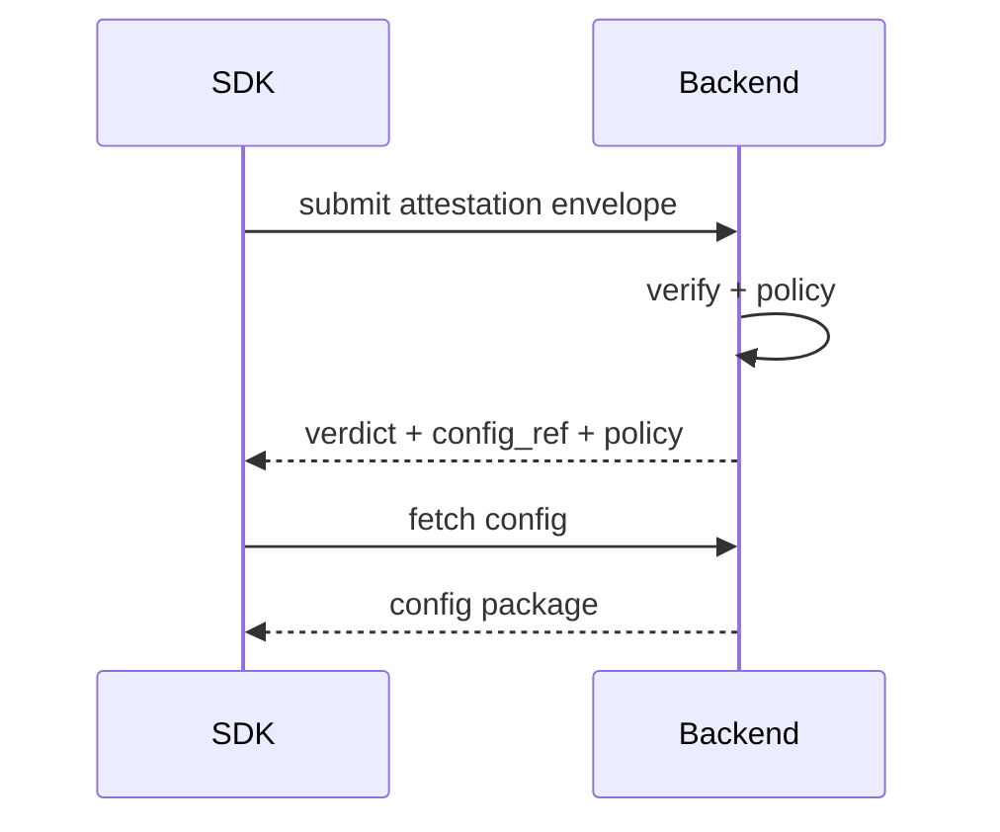

# RFC-0002 — Backend Abstraction and Conformance Model

## Status
In Review

## Summary
Define the canonical backend contract for the Attest SDK, including verification, policy decisioning, configuration delivery, and conformance requirements for Digitalis and custom backends. This RFC ensures identical security semantics regardless of backend operator.

---

## Mental Model (authoritative)
The backend is the **control plane** for client trust.

- The SDK collects signals; the backend decides.
- Policy, configuration, TTL, and degradation are **backend-defined**.
- Custom backends are allowed only if they **conform semantically**, not just structurally.

---

## Scope
- Verification endpoint contract
- Policy decision model
- Configuration retrieval contract
- Capability negotiation
- Versioning
- Conformance and certification requirements

Non-goals:
- SaaS/multi-tenant design
- Billing/licensing
- UI/operational tooling

---

## Core Invariants (MUST hold)
1. **Backend Authority**
   - Final trust decisions MUST originate from the backend.

2. **Semantic Consistency**
   - All conforming backends MUST produce equivalent outcomes for equivalent inputs.

3. **No Silent Downgrade**
   - Capability negotiation MUST NOT silently weaken required controls.

4. **Deterministic Outcomes**
   - Backend responses MUST map to canonical outcomes (RFC-0006).

5. **Versioned Contract**
   - All interactions MUST be versioned and forward-compatible.

---

## High-Level Flow



---

## API Surface (logical)

### 1. Verification Endpoint

**Request**
- normalized attestation envelope (RFC-0003)
- SDK metadata (version, platform)
- identity metadata (mode, install/device)

**Response**
- `verdict`: MUST map exactly to RFC-0006 canonical outcomes (`ALLOW`, `ALLOW_DEGRADED`, `RETRYABLE_FAILURE`, `DENY_POLICY`, `DENY_INTEGRITY`, `UNSUPPORTED_ENVIRONMENT`)
- `policy_mode`
- `ttl`
- `config_ref` (or inline config)
- `capabilities`

### 2. Configuration Endpoint

**Request**
- `config_ref`
- optional identity binding context

**Response**
- config package (RFC-0004)

### 3. Capability Endpoint (optional)

**Purpose**
- advertise backend features
- enable compatibility checks

---

## Policy Model

The backend MUST evaluate:
- attestation validity
- provider capability sufficiency
- app identity
- environment risk signals
- TTL / freshness

The backend MAY consider:
- historical telemetry
- risk scoring
- anomaly detection

### Output
Policy produces:
- verdict
- TTL
- config authorization
- degraded mode flags

---

## Capability Negotiation

### Requirements
- Backend MUST declare capability set
- SDK MUST validate compatibility
- Incompatible capability MUST result in explicit failure

### Examples
- supports strong binding
- requires pinning
- requires hardware-backed storage

---

## Versioning

### Contract Version
- Every request MUST include `contract_version`
- Backend MUST reject unsupported versions explicitly

### SDK Version Awareness
- Backend MAY enforce minimum SDK version

### Config Version
- Managed separately (RFC-0004)

---

## Custom Backend Invariants

Custom backends MUST preserve RFC-0001 invariants (trust bootstrap state machine, authority model, and activation guards) and RFC-0004 lifecycle guarantees (config versioning, rotation, rollback resistance, and revocation handling). A backend that is structurally compatible but weakens these invariants is non-conforming.

## Conformance Model

Custom backends MUST pass a conformance suite covering:

### 1. Protocol Compatibility
- request/response schema validation

### 2. Semantic Compatibility
- identical verdicts for known test vectors
- semantic equivalence test vectors MUST verify that the backend produces the same canonical outcome (RFC-0006) for equivalent inputs across all failure classes, including edge cases in expiry, revocation, rollback rejection, and integrity failure

### 3. Negative Path Testing
- expired evidence
- malformed evidence
- replay attempts

### 4. Config Lifecycle Tests
- rotation
- rollback rejection
- revocation handling

### 5. Security Regression
- no silent downgrade
- correct TTL enforcement

---

## Identity Handling

Backend MUST support:
- device-influenced identity (default)
- install identity (fallback)

Backend MUST NOT require user identity for trust bootstrap.

---

## Trust Establishment (Transport)

### Baseline
- TLS required

### Upgrade Path
- dynamic pinning via protected config

### Requirement
- backend identity MUST be strongly authenticated

---

## Error Model (normative)

Backend MUST return structured errors:

- `DENY_POLICY`
- `DENY_INTEGRITY`
- `RETRYABLE_FAILURE`
- `UNSUPPORTED_ENVIRONMENT`

Errors MUST be machine-readable and deterministic.

---

## Telemetry & Audit (Required)

Backend MUST log:
- verification attempts
- verdict outcomes
- config issuance
- failures and anomalies

Recommended fields:
- timestamp
- provider_id
- config_version
- sdk_version
- identity_mode
- outcome

---

## Runtime Invariants

```ts
assert(backend_verdict in CANONICAL_OUTCOMES)
assert(ttl <= MAX_TTL)
assert(config_ref != null || verdict != ALLOW)
assert(no_silent_capability_downgrade == true)
```

---

## Security Considerations

- Custom backends expand attack surface; conformance is mandatory
- Capability misreporting can cause over-trust
- Backend impersonation must be mitigated (pinning roadmap)
- Policy complexity can introduce inconsistencies if not tested

---

## Open Questions

- Standardized conformance test suite format
- Capability schema versioning strategy
- Multi-region backend consistency guarantees

---

## Consequences

Pros:
- consistent security model across deployments
- backend-driven flexibility
- scalable policy evolution

Cons:
- increased backend responsibility
- need for conformance enforcement
- versioning complexity

---

## Dependencies
- RFC-0001 (trust bootstrap)
- RFC-0003 (attestation abstraction)
- RFC-0004 (config lifecycle)
- RFC-0006 (outcome definitions)

