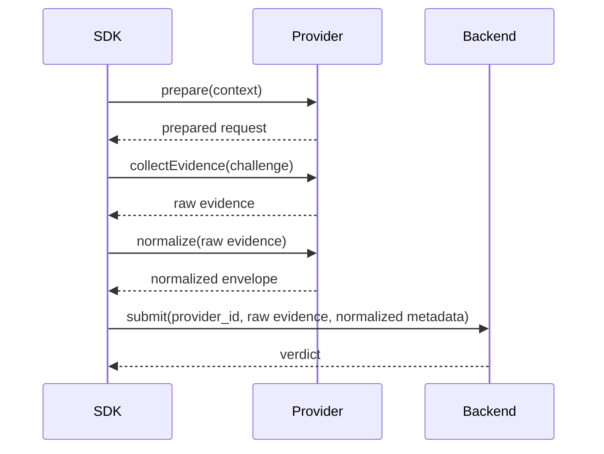

# RFC-0003 — Unified Attestation Provider Abstraction

## Status
In Review

## Summary
Define a single internal attestation abstraction for Apple and Google attestation services such that the SDK exposes one control flow and one backend contract while preserving provider-specific semantics, evidence, and capability differences.

---

## Mental Model (authoritative)
The abstraction exists to unify **orchestration**, not to erase **security meaning**.

A correct abstraction should make it easy for the SDK to:
- request attestation evidence
- normalize metadata needed for transport and policy
- preserve raw provider evidence for backend verification
- report provider capabilities and failure modes

A dangerous abstraction would collapse all provider outputs into a single coarse boolean such as `trusted=true` and discard assurance differences that matter to backend policy.

---

## Problem
Apple and Google attestation systems differ in:
- API shape
- evidence format
- freshness and lifecycle behavior
- available claims
- operational error conditions
- supported assurance semantics

Without a strong abstraction boundary, the SDK risks either:
- leaking provider-specific complexity into core startup flow, or
- flattening meaningful differences into an unsafe lowest common denominator

---

## Goals
- One SDK attestation orchestration model across platforms
- Preserve provider-specific evidence required for backend verification
- Normalize transport metadata and capability signaling
- Make backend policy capability-aware
- Support future providers without changing core bootstrap semantics

## Non-Goals
- Defining provider verification logic on the client
- Forcing identical evidence structures across providers
- Concealing all provider differences from backend policy
- Replacing backend authority with client-side evaluation

---

## Core Invariants (MUST hold)
1. **Raw Evidence Preservation**
   - Raw provider evidence MUST be preserved for backend verification.

2. **No Semantic Flattening**
   - The abstraction MUST NOT collapse materially different assurance levels into a single trust meaning without explicit policy context.

3. **Backend Awareness**
   - The backend MUST be informed of provider identity and relevant capability metadata.

4. **Deterministic Failure Signaling**
   - Provider failures MUST produce deterministic error classes for startup policy handling.

5. **Client Is Not Authoritative**
   - Local normalization MAY sanity-check but MUST NOT become the source of trust decisions.

---

## Provider Model
The SDK MUST expose a single internal interface for all attestation providers.

### Logical Interface
```ts
interface AttestationProvider {
  prepare(context: PrepareContext): Promise<PreparedRequest>
  collectEvidence(challenge: Challenge): Promise<CollectedEvidence>
  normalize(result: CollectedEvidence): Promise<NormalizedAttestation>
  reportCapabilities(): ProviderCapabilities
}
```

### Purpose of Each Method
- `prepare(...)`
  - resolves provider prerequisites
  - prepares request context
  - determines whether provider is supported and available

- `collectEvidence(...)`
  - interacts with platform attestation API
  - obtains raw evidence bound to challenge where supported

- `normalize(...)`
  - constructs transport-safe normalized metadata
  - preserves raw evidence blobs and provider identity
  - classifies collection outcomes for backend + telemetry use

- `reportCapabilities()`
  - exposes provider features and limits to policy layers

---

## Normalized Attestation Envelope
The normalized envelope SHOULD include at minimum:

- `provider_id`
- `provider_version` if available
- `raw_evidence`
- `challenge_binding_data`
- `collected_at`
- `app_identity_claims`
- `device_or_environment_claims`
- `collection_diagnostics`
- `capability_flags`

Optional fields:
- `local_nonce_id`
- `sdk_version`
- `identity_mode`
- `evidence_format`
- `collection_mode`

---

## Capability Model
The abstraction SHOULD make capability differences explicit.

### Example Capability Flags
- challenge binding supported
- app identity claim supported
- device integrity claim supported
- hardware-backed assertion available
- offline collection supported
- freshness timestamp available
- replay resistance metadata available

The capability model exists so the backend can reason about:
- what this provider can assert
- what this provider cannot assert
- whether policy for a given project/backend mode should allow, degrade, or deny

Provider capability reporting informs backend policy but does **not** directly authorize degradation. Only backend policy (RFC-0006) may authorize degraded operation based on provider capability information.

---

## Provider Selection Model

### Baseline
- Android MUST use the Google attestation adapter where supported
- Apple platforms MUST use the Apple attestation adapter where supported

### Selection Rules
- Only one attestation provider may be active for a given startup flow
- Provider selection MUST be deterministic for the current platform
- Unsupported provider states MUST produce explicit failure results

### Future Extensibility
The abstraction MAY support future provider types, but new providers MUST not alter the core startup semantics defined in RFC-0001.

---

## Local Validation Rules
The client MAY perform local validation only for:
- API shape sanity
- serialization checks
- basic completeness checks
- local timestamp / challenge correlation checks

The client MUST NOT treat local validation as sufficient for:
- authenticity
- trust verdicts
- policy allow/deny decisions

This is important because local validation is part of robustness, not authority.

---

## Attestation Cadence Integration
This RFC aligns with RFC-0001.

### Minimum Requirement
- Attestation MUST run at cold start

### Optional Policy Modes
- foreground resume
- periodic background refresh
- per sensitive operation
- cached verdict reuse within TTL

The provider abstraction MUST support repeated invocation without leaking prior state across runs unless explicitly intended.

---

## Error Taxonomy (normative)
Provider adapters MUST map raw platform failures into canonical collection classes.

### Required Error Classes
- `UNSUPPORTED_PROVIDER`
- `PROVIDER_UNAVAILABLE`
- `CHALLENGE_REJECTED`
- `EVIDENCE_COLLECTION_FAILED`
- `EVIDENCE_MALFORMED`
- `LOCAL_NORMALIZATION_FAILED`
- `TIMEOUT`

These classes MUST be deterministic enough for RFC-0006 startup policy to distinguish:
- retryable failures
- deny-worthy failures
- unsupported-environment failures

Provider error classes map into final canonical outcomes owned by RFC-0006. The provider layer classifies collection failures, but RFC-0006 owns the authoritative outcome mapping. Provider adapters MUST NOT themselves determine the final startup outcome.

---

## Sequence Model



---

## Security Requirements
1. Provider adapters MUST preserve raw evidence exactly as required for backend verification.
2. Normalization MUST NOT discard security-relevant claims.
3. The SDK MUST communicate provider identity to backend policy layers.
4. Capability flags MUST be accurate; false elevation of provider capability is a security defect.
5. Any unsupported or partially supported provider condition MUST fail explicitly.
6. The abstraction SHOULD preserve diagnostics needed for operational troubleshooting without leaking secrets.

---

## Platform-Semantic Preservation
The abstraction MUST preserve the fact that:
- provider outputs may have different assurance meanings
- available claims may differ by platform and OS version
- collection behavior may differ across device states and release conditions

Therefore:
- backend policy MUST remain provider-aware
- product teams MUST NOT assume parity where none exists

---

## Telemetry & Audit Events (Required)
The SDK MUST emit structured events for:
- provider selection
- attestation collection start
- attestation collection success/failure
- normalization success/failure
- capability report snapshot
- backend submission correlation

Recommended fields:
- timestamp
- provider_id
- sdk_version
- platform
- os_version
- capability_flags
- outcome_code

---

## Runtime Invariants (Code-Level)

```ts
assert(normalized.provider_id != null)
assert(normalized.raw_evidence != null)
assert(local_allow_decision == undefined)
assert(provider_capabilities_reported == true)
assert(normalization_success == true || attestation_submitted == false)
```

---

## Testing Expectations
A conforming provider adapter SHOULD be tested for:
- successful evidence collection
- malformed evidence handling
- timeout behavior
- challenge binding propagation
- unsupported environment behavior
- capability reporting accuracy
- repeated invocation safety

---

## Security Considerations
- A normalized envelope is not itself a trust proof; it is a transport and policy input.
- Capability inflation is a subtle but serious defect because it can cause backend over-trust.
- Providers may drift across OS/platform versions; compatibility testing must account for this.
- Local sanity checks improve resilience but do not reduce the need for authoritative backend verification.

---

## Open Questions
- Whether provider-specific claim subsets should be re-expressed in a canonical schema or passed through only as tagged metadata
- Whether diagnostics need privacy-tiered redaction rules by deployment mode
- Whether provider adapters should expose explicit minimum platform/version requirements in capability metadata

---

## Consequences
Pros:
- cleaner SDK startup orchestration
- provider-aware backend policy
- easier future extensibility
- reduced platform-specific branching in host integration

Cons:
- more care required to avoid semantic flattening
- capability schema must be maintained over time
- diagnostics and compatibility testing become part of the contract

---

## Dependencies
- RFC-0001 defines overall trust bootstrap state machine and authority model
- RFC-0006 must define canonical outcome mapping and policy handling for provider errors
- RFC-0002 must preserve provider-related semantics in backend conformance rules

